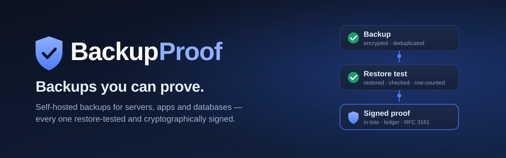

<p align="center">
  
</p>

<p align="center">
  <a href="https://github.com/chmuzamil/BackupProof/releases"></a>
  <a href="https://github.com/chmuzamil/BackupProof/actions/workflows/test.yml"></a>
  <a href="go.mod"></a>
  <a href="LICENSE"></a>
  <a href="#install"></a>
  <a href="#how-the-proof-works"></a>
  <a href="#how-the-proof-works"></a>
</p>

BackupProof is a self-hosted backup system for servers, applications and databases that **proves every backup can be restored**. It restores each backup into an isolated sandbox, checks the data, and records signed, tamper-evident proof that an auditor can verify offline.

> A green "backup succeeded" tells you a job ran. It doesn't tell you the data comes back.
> BackupProof shows an item as **Restore tested ✓** only after it has been restored from storage and checked.

One static binary is the dashboard server, the agent for each protected server, and a standalone CLI. **New here?** Read the plain-language [Getting started guide](docs/GETTING-STARTED.md).

<p align="center">
  <a href="https://backupproof.dev"><b>Website</b></a> &nbsp;·&nbsp;
  <a href="https://demo.backupproof.dev"><b>Live demo</b></a> &nbsp;·&nbsp;
  <a href="https://backupproof.dev/docs/"><b>Docs</b></a> &nbsp;·&nbsp;
  <a href="https://github.com/chmuzamil/BackupProof/releases/latest"><b>Download</b></a>
</p>

## Demo

**Try the dashboard:** [demo.backupproof.dev](https://demo.backupproof.dev), username `demo`, password `backupproof-demo`. It protects a made-up bakery (website, documents and an order database) with real scheduled backups, restore tests and signed proofs. The account is read-only and the demo is rebuilt with fresh made-up data every day.

A restore test from the CLI. The dashboard shows the same checks in plain words.

```console
$ backupproof drill --repo /mnt/backup/vault --spec examples/sqlite.json

  [PASS] restore-from-storage    1 files, 20480 bytes, every chunk authenticated and every file hash verified
  [PASS] content-root            Merkle root of 2 restored entries matches the snapshot (8214bb845872828e…)
  [PASS] sqlite-integrity-check  PRAGMA integrity_check = ok
  [PASS] row-count-reconciliation  2 tables, 600 rows reconciled with backup-time counts (exact)
  [PASS] assert: users exist     returned 1

RTO 41ms · restored 20480 bytes · sandbox embedded-sqlite (read-only)
attestation 4af524f509f545e9… recorded at ledger #4

$ backupproof proof verify drill.bundle.json --key bpkey1:server@backup:… --require-timestamp
VALID  https://backupproof.dev/attestation/restore-drill/v1
  signer    agent:web-01 (bp:e96a62db83be1b16)
  drill     passed=true
  ledger    entry #13, chained to signed checkpoint #14
  time      2026-10-06T22:20:28Z (RFC 3161, https://freetsa.org/tsr)
```

## Install

### Dashboard server

The dashboard machine is protected straight away by its built-in agent ("This server"), so nothing else needs installing on it.

**Linux / macOS** (installs a service and prints the address and a one-time setup code):

```bash
curl -fsSL https://github.com/chmuzamil/BackupProof/releases/latest/download/install.sh | sudo sh
```

**Windows** (PowerShell as Administrator):

```powershell
irm https://github.com/chmuzamil/BackupProof/releases/latest/download/install.ps1 | iex
```

**Docker:**

```bash
docker run -d --name backupproof -p 8420:8420 -v backupproof-data:/data ghcr.io/chmuzamil/backupproof:latest
docker logs backupproof 2>&1 | grep "setup code"
```

Or with Docker Compose, using the [docker-compose.yml](docker-compose.yml) from this repository: download it, then run `docker compose up -d`.

Open the address shown and create the admin account. There is no default password. Unless you open the dashboard on the machine itself, creating that first account needs the **setup code** the installer printed, so nobody else on the network can claim it first.

### Use it over the internet (HTTPS)

Put the dashboard behind HTTPS before servers connect to it over the internet: their jobs carry storage passwords.

1. Point a domain name at the server, for example a DNS **A record** for `backup.example.com` with the server's IP address.
2. Run the installer with `--domain`. On Linux it sets up HTTPS for you: it uses nginx (with a free Let's Encrypt certificate from certbot) or Caddy if one is installed, and installs Caddy if neither is. The dashboard then only listens on `127.0.0.1`, and its public address is set to `https://backup.example.com`.

   ```bash
   curl -fsSL https://github.com/chmuzamil/BackupProof/releases/latest/download/install.sh | sudo sh -s -- --domain backup.example.com --email you@example.com
   ```

3. Open `https://backup.example.com` and create the admin account with the setup code.

Already have HTTPS in front of it (your own proxy, a load balancer or a tunnel)? Set the address yourself instead, and keep the dashboard local:

```bash
curl -fsSL https://github.com/chmuzamil/BackupProof/releases/latest/download/install.sh | sudo sh -s -- --public-url https://backup.example.com --listen 127.0.0.1:8420
```

You can also change the address later under **Settings**. Options always go after `sh -s --`: `curl … | sudo sh --public-url …` fails with `Illegal option`.

### Installer options

| Linux / macOS | Windows | What it does |
|---|---|---|
| `--domain NAME` | | Serve the dashboard at `https://NAME` and set up HTTPS (Linux) |
| `--email ADDR` | | Email for certificate expiry notices (with `--domain`) |
| `--public-url URL` | `-PublicUrl URL` | The address other servers use to reach the dashboard |
| `--listen ADDR` | `-Listen ADDR` | Address and port to listen on (default `0.0.0.0:8420`; `127.0.0.1:8420` with `--domain`) |
| `--version vX.Y.Z` | `-Version vX.Y.Z` | Install a specific release |
| `--uninstall` | `-Uninstall` | Remove the service and program; your data is kept |

Re-running the installer upgrades BackupProof in place and keeps your data. On Linux and macOS it also keeps the address and listen settings, so you don't need to repeat the options.

### Uninstall

Linux / macOS:

```bash
curl -fsSL https://github.com/chmuzamil/BackupProof/releases/latest/download/install.sh | sudo sh -s -- --uninstall
```

Windows (PowerShell as Administrator):

```powershell
& ([scriptblock]::Create((irm https://github.com/chmuzamil/BackupProof/releases/latest/download/install.ps1))) -Uninstall
```

This removes the service and the program. Your data is kept (`/var/lib/backupproof` on Linux, `/Library/Application Support/BackupProof` on macOS, `C:\ProgramData\BackupProof\server` on Windows); delete that folder to remove everything. Your backups in storage are not touched. If you installed with `--domain`, the web server site (`backupproof-NAME.conf` for nginx, or the block in `/etc/caddy/Caddyfile`) and the certificate are left in place; remove them yourself if you no longer need them.

### Other servers

In the dashboard, open **Servers → Connect a server** and copy the one-line command for Linux, macOS or Windows. It downloads the agent from your dashboard, connects it with a single-use code (valid for 1 hour) and keeps it running as a service.

Agents connect **outbound only** over HTTPS. Backup data goes straight from each server to storage and never passes through the dashboard.

### Manual download

Binaries for Linux, macOS and Windows (amd64 and arm64) and `SHA256SUMS` are attached to every [release](https://github.com/chmuzamil/BackupProof/releases). Run `backupproof server` to start the dashboard, or `backupproof help` for everything else.

### Build from source

```bash
make build   # bin/backupproof (static, CGO_ENABLED=0)
make dist    # every platform into dist/downloads, served to the one-line installers
```

Requires Go 1.27+ (see `go.mod`). The binary is pure Go, with SQLite via `modernc.org/sqlite` and no cgo.

## Getting started

1. **Storage → Add.** Choose a disk, Backblaze B2, Amazon S3, Cloudflare R2, Wasabi, another S3-compatible service, or SFTP. Click **Test connection**, then keep the generated encryption password and download the recovery kit.
2. **Protect something.** Pick the server, then *what* (suggested folders, websites, WordPress and Docker databases are listed for you), *where*, and *how often*.
3. Watch the item go from **Not tested yet** to **Restore tested ✓**. The first backup is restore-tested immediately.

### Standalone CLI (one machine, no server)

```bash
export BP_PASSWORD='a long repository password'   # store it offline too
backupproof init   --repo /mnt/backup/vault
backupproof backup --repo /mnt/backup/vault --name website /var/www
backupproof backup --repo /mnt/backup/vault --spec examples/postgres.json   # BP_SOURCE_PASSWORD for the DB
backupproof drill  --repo /mnt/backup/vault --spec examples/postgres.json --timestamp
backupproof proof export --repo /mnt/backup/vault <digest> -o drill.bundle.json
```

S3 with Object Lock: `--repo 's3://bucket/vault?endpoint=https://s3.eu-central-003.backblazeb2.com&lock=COMPLIANCE&lockDays=30'`, with credentials from `AWS_ACCESS_KEY_ID` and `AWS_SECRET_ACCESS_KEY`. Run `backupproof help` for every command.

## Features

| | |
|---|---|
| **Backs up** | File trees, PostgreSQL, MySQL/MariaDB, MongoDB, SQLite, or any command's output. Pre/post hooks quiesce applications. Database logins are read from Docker containers and WordPress `wp-config.php` on the server itself. |
| **Stores** | An encrypted, deduplicating, content-addressed repository on a local disk, any S3-compatible service (with optional **S3 Object Lock**), or SFTP with a pinned host key. |
| **Proves** | Scheduled **restore tests** restore a backup into an empty folder or a `--network none` database container. Checks per data type:<br>• All data: the restored bytes must reproduce the snapshot's Merkle root.<br>• PostgreSQL: `amcheck` with `heapallindexed`.<br>• MySQL/MariaDB: `CHECK TABLE`.<br>• MongoDB: `validate(full)`.<br>• SQLite: `integrity_check`.<br>• Databases: row counts reconciled against counts captured at backup time.<br>• PostgreSQL dumps found inside file backups are loaded into a test database.<br>• Your own SQL assertions and commands. |
| **Attests** | Each backup and restore test, pass *or fail*, becomes an [in-toto](https://in-toto.io) statement in a DSSE envelope, signed with the agent's Ed25519 key. It is optionally timestamped by an RFC 3161 TSA and appended to a hash-chained ledger with signed checkpoints. |
| **Watches** | A dead-man's-switch watchdog alerts on what *didn't* happen: overdue backups, stale proofs and silent servers. Alerts go to a webhook (Slack, Discord, Mattermost) or email, and the server can ping an external heartbeat URL. |
| **Imports** | Existing backups are fetched, decrypted and converted into restore-tested copies that keep their original dates: **GPG / OpenSSL / age** encrypted files in a bucket or folder (archives can be unpacked), **restic** (reusing `/etc/restic/env`), **Kopia**, **BorgBackup**, and files on **Google Drive, Dropbox, OneDrive** and 70+ services via rclone. |
| **Exports** | Per-proof bundles and a period **evidence pack** mapped to SOC 2 A1.2/A1.3, ISO 27001 A.8.13, NIST CSF, DORA Art. 12, NIS2 Art. 21 and HIPAA, plus a printable report. |

The dashboard uses plain language ("Restore tested ✓", "Needs attention"), works on phones, supports dark mode and the keyboard, and follows the [Web Interface Guidelines](https://github.com/vercel-labs/web-interface-guidelines).

## How the proof works

```
backup ──► snapshot ─► Merkle root R (BLAKE3 over path,type,size,content-hash)
              │
              ├─► attestation{backup, subject=R, source meta, storage, lock}  ─┐  signed by the agent
              │                                                                │  (Ed25519, DSSE)
drill  ──► restore from storage ─► recompute root R' from the bytes on disk    │
              ├─► R' == R ?  integrity checks · row reconciliation · asserts   │
              └─► attestation{drill, subject=R, checks, RTO, sandbox image}  ──┤
                                                                               ▼
                         ledger:  hash_n = SHA256(seq,time,kind,subject,envelope_digest,hash_{n-1})
                                  (append-only; DB triggers reject UPDATE/DELETE)
                                  signed checkpoint over the head  ·  optional RFC 3161 token
```

- **The content root is unkeyed.** Blob names are keyed MACs, so storage observers learn nothing about the contents. The Merkle root, by contrast, can be recomputed by *anyone* who holds the restored data, so an auditor can match restored data to the signed statement without the repository password.
- **Failures are recorded too.** A failed restore test is signed and ledgered like a passing one. Deleting it breaks the hash chain.
- **Only verified backups are tested.** A restore test restores the exact snapshot named in the backup proof the server verified from that item's own server, and checks its content root before restoring.
- **Separation of duties.** An item can name a different server for restore tests. That server restores using only the repository and its own signing key.
- **Unbiased sampling.** Storage health checks pick their sample from the current ledger head, so an operator can't steer the check away from data they know is bad.
- **Keep-last-verified retention.** GFS retention, with restic-compatible semantics, never forgets the newest snapshots that passed a restore test.

Verify offline, without the repository password and without trusting the server:

```bash
backupproof proof verify drill.bundle.json --key bpkey1:server@backup:… --key bpkey1:agent:web-01:… --require-timestamp
backupproof proof verify-pack evidence.json --key …
```

## Repository format (v1)

| Object | Contents |
|---|---|
| `config` | Format, version, repository ID, chunker parameters (plaintext, no secrets). |
| `keys/<id>` | Password slots. Argon2id (t=3, 64 MiB, p=4) derives a KEK, which wraps random master keys with XChaCha20-Poly1305. Add a break-glass slot with `key-add`. |
| `data/<id[:2]>/<id>` | Chunks from FastCDC (512 KiB / 1 MiB / 8 MiB, gear table derived from a secret seed). Each chunk is zstd-compressed and sealed with XChaCha20-Poly1305 (random 192-bit nonce, AAD = object name). The ID is BLAKE3 keyed by a MAC key over the plaintext and is re-checked on every read. |
| `snapshots/<id>` | Encrypted snapshot record: source, host, time, Merkle root, stats, database metadata, and the IDs of the chunked manifest. |
| `proofs/<digest>.json` | Signed attestations (public; they contain hashes and counts, never file names or data). |

Deduplication works across files and snapshots. Unchanged files (same size and mtime) reuse their chunk lists. Writes are lock-free. Prune deletes only unreferenced blobs older than a grace period, and refuses to run if any snapshot is unreadable.

## Configuration

| Variable / flag | Default | Purpose |
|---|---|---|
| `BP_DATA` / `--data` | `./backupproof-data` | Dashboard data folder (database, keys) |
| `BP_LISTEN` / `--listen` | `:8420` | Listen address |
| `BP_PUBLIC_URL` / `--public-url` | derived | Address other servers use; also settable in **Settings** |
| `BP_SECRET_KEY` | generated `secret.key` | 64 hex chars; encrypts stored passwords and keys |
| `BP_DOWNLOADS` / `--downloads` | `DATA/downloads` | Agent binaries served to the one-line installers |
| `--no-local-agent` | off | Disable the built-in "This server" agent |
| `BP_STATE` | `~/.backupproof` | Agent / CLI state folder |
| `BP_PASSWORD`, `BP_PASSWORD_FILE` | | Repository password for the CLI |

## Security model

- **Secrets at rest.** Repository passwords, storage and database credentials are encrypted in the dashboard database with a 256-bit key (`secret.key` or `BP_SECRET_KEY`). They are sent only to the agent holding the job lease.
- **Agents.** Each agent has its own Ed25519 attestation key and a bearer token, stored hashed. The server checks every attestation's signature against the enrolled key, and that it describes the leased job's item, before ledgering it.
- **Accounts.** Argon2id password hashes, HttpOnly `SameSite=Strict` session cookies and CSRF tokens. Roles are admin, operator and auditor (read-only plus evidence). Anything that could give control of a server is admin-only: commands and hooks, custom restore-test commands, moving an item to another server, connecting servers, on-the-fly rclone remotes and previewing old backups. Every operator action is written to the same ledger as the proofs.
- **Built-in agent.** It never backs up, imports from, or stores into the server's own data folder, even when asked to protect `/` or `C:\`.
- **Restores.** All writes go through an `os.Root` confined to the restore folder, and symlinks are created last, so a crafted snapshot can't write outside it.
- **Web.** Strict CSP (`default-src 'self'`), `X-Frame-Options: DENY`, no third-party assets.
- **Restore-test sandboxes.** `--network none`, memory, CPU and PID limits, `no-new-privileges`, data on tmpfs, restored files mounted read-only, and the image recorded by digest.
- **Ransomware.** Use S3 Object Lock in COMPLIANCE mode and storage credentials that cannot delete. Prune skips locked objects. Run restore tests on a different server.

## Documentation

- [Getting started](docs/GETTING-STARTED.md): plain-language guide for non-technical users
- [Example item settings](examples/): PostgreSQL, MySQL in Docker, WordPress, SQLite, MongoDB, Docker Compose apps
- [Research notes](docs/RESEARCH.md): market and technical research behind the design
- [Changelog](CHANGELOG.md)

## Roadmap

- Pack files (batch small chunks) and a local index cache for very large repositories
- PostgreSQL physical/PITR (pg_basebackup + WAL, `pg_verifybackup`) and MySQL physical (XtraBackup/mariabackup `--prepare`)
- MSSQL (`RESTORE` + `DBCC CHECKDB`) and Redis (`redis-check-rdb` + key digests)
- mTLS agent identities with short-lived certificates; transparency-log (C2SP tlog-tiles) checkpoints with witness co-signing
- Object Lock retention extension during maintenance; repository-to-repository copy for 3-2-1
- Docker volume and Kubernetes PVC sources; Windows VSS snapshots

## Contributing

Contributions are welcome. See [CONTRIBUTING.md](CONTRIBUTING.md) for setup, tests and the pull-request checklist.

## License

[MIT](LICENSE) © 2026 chmuzamil

---

<p align="center">Made by <a href="https://chaudhery.com"><b>Chaudhery Studio</b></a></p>
